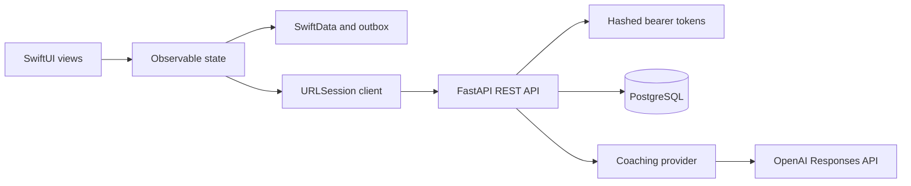

# Architecture

The iOS app owns the immediate user experience and remains useful when offline. SwiftData stores the quit plan, craving history, coaching transcript summaries, response cache, and an outbox. URLSession sends typed JSON requests when connectivity is available. The anonymous bearer token is isolated in Keychain.

The FastAPI service authenticates the token hash, validates requests with Pydantic, persists synchronized data in PostgreSQL, calculates canonical progress, and delegates coaching to a provider interface. The OpenAI adapter receives only the latest ten conversation turns and a bounded behavioural-coaching instruction. Crisis phrases bypass the model and return a fixed escalation response.

The client retries only idempotent check-in writes using the local operation UUID as `Idempotency-Key`. Account deletion is deliberately fail-closed: if server deletion cannot be confirmed, local credentials and data remain available so deletion can be retried.

